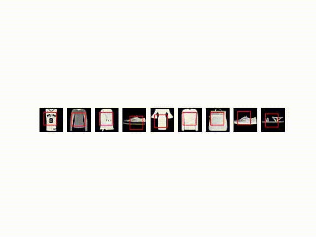

# Recurrent Visual Attention

<!-- TABLE OF CONTENTS -->
## Table of Contents

* [About the Project](#about-the-project)
* [Getting Started](#getting-started)
  * [Prerequisites](#prerequisites)
  * [Installation](#installation)
* [Usage](#usage)
* [License](#license)
* [References](#references)


<!-- ABOUT THE PROJECT -->
## About The Project



This is a **PyTorch** implementation of [Recurrent Models of Visual Attention](https://arxiv.org/abs/1406.6247) by *Volodymyr Mnih, Nicolas Heess, Alex Graves and Koray Kavukcuoglu*.
This repository extends the original [github repository](https://github.com/kevinzakka/recurrent-visual-attention) by kevin zakka for Fashion MNIST dataset.

The Recurrent Attention Model (RAM) is a neural network that processes inputs sequentially, attending to different locations within the image one at a time, and incrementally combining information from these fixations to build up a dynamic internal representation of the image.


<!-- GETTING STARTED -->
## Getting Started

These instructions will get you a copy of the project up and running on your local machine for development and testing purposes.

### Prerequisites

Following packages needs to be installed before running the code.
* python 3.7 or above
* PyTorch 1.6
* numpy 1.19.1
* pyyaml 5.3.1
* ffmpeg 4.3.1
* matplotlib 3.3.1
* tqdm 4.49.0
* tensorboard-logger 0.1.0


### Installation

1. Clone the repo
```sh
git clone https://github.com/aditya02acharya/RNN_Attention_Classification.git
```

<!-- USAGE EXAMPLES -->
## Usage

To start training the RAM model is to edit the parameters in src/parameters/params.py and run the following command:

```sh
python main.py --train
```

To resume training, run:

```sh
python main.py --train --resume
```

To test a checkpoint of your model that has achieved the best validation accuracy, run the following command:

```sh
python main.py
```


<!-- LICENSE -->
## License

Distributed under the MIT License. See `LICENSE` for more information.


<!-- REFERENCE -->
## References

* [Recurrent Models of Visual Attention](https://arxiv.org/abs/1406.6247)
* [Kevin Zakka Github Repository](https://github.com/kevinzakka/recurrent-visual-attention)
* [Torch Blog Post on RAM](http://torch.ch/blog/2015/09/21/rmva.html)

